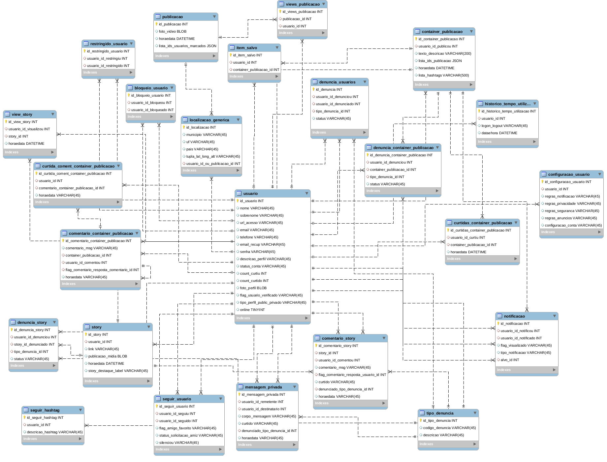

# Desafio - Engenheiro de Dados

Resolução do desafio técnico para Engenheiro de Dados na Liberfly.

## Parte 1 - Modelagem

#### Desafio 
Fazer a modelagem de um banco de dados relacional MySQL, para um aplicativo que é uma cópia do Instagram. 

#### Solução

O código em SQL para a construção do banco é encontrado na pasta 'model'.



Este modelo suporta as principais funcionalidades de um sistema similar ao instagram, como:

* Criar perfís de usuários através de um email único
* Bloquear, restringir ou silenciar outros usuário
* Acompanhar(curtir) outros usuários e hashtags
* Realizar postagens em story ou linha do tempo
    * As postagens na linha do tempo podem compor apenas uma mídia(foto ou vídeo) ou várias. No modelo, as entidades 'publicacao' e 'container_publicacao'
    representam essa relação. A entidade 'publicacao' representa as unidades das postagens contendo suas informações particulares como usuários marcados, localização e foto/video. Já a entidade 'container_publicacao' contém uma descrição; uma lista de hashtags; e a lista de ids 'publicacao' que irão 
    compor o álbum. 
* Curtir e comentar postagens de outros usuários
* Comentar stories de outros usuários
* Curtir comentários de postagens/stories
* Responder comentário de postagem
    * O atributo 'flag_comentario_resposta_comentario_id' na entidade 'comentario_container_publicacao' armazenará o id do comentário pai.
* Denunciar usuários, postagens, stories e comentários de postagens/stories
* Salvar item-publicação em lista de itens de usuário
* Calcular tempo de uso no aplicativo
* Conversar no modo privado com outros usuários
* Curtir ou denunciar mensagens privadas
* Controle de notificações
* Acesso à configurações pessoais

## Parte 2 - Desenvolvimento

#### Desafio 
Desenvolver um programa em Python que localiza cidades a partir de uma lista de ceps. A informação deve ser consultada inicialmente em um banco de dados local e caso não encontre, consulte na API viaCEP.  

#### Solução
O programa desenvolvido, permite consultar e informar todas as cidades encontradas a partir da lista de CEPs.

Para isso foi desenvolvido um módulo chamado cep.py que ao ser importado e instanciado. Carrega na memória o banco de dados local com as informações que serão necessárias na busca.

```bash
from cep import CEP
cep = CEP(db_local_address="data/Banco_ceps.xlsx")
```

Para inicializar a busca chama-se a função '\__get_cities__' passando como argumento o endereço do arquivo que contém a lista de CEPs que serão buscados.

```bash
list_cities_found = cep.__get_cities__(ceps_address="data/ceps.csv")
```

Assim, o programa armazena a lista de CEPs que serão buscados, e após isso, inicia a busca. A consulta é realizada primeiro no banco de dados local. E caso não encontre, busca na API.

Ao fim da consulta é retornado a lista de localidades encontradas na busca.

Essa lista pode ser gravada em formato CSV utilizando a função '\__write_output_csv__'.

```bash
cep.__write_output_csv__(list_cities_found=list_cities_found, filename_out="output_cities", header="Localidade")
```


### Instalando dependências

Devem ser instaladas de preferência em um ambiente virtual.
```
!pip install pandas
!pip install requests
```

### Uso

Pode ser testado através de um dos comandos:

```bash
# opção 1 - Caso queira passar os endereços do banco de dados local e do arquivo que contém a lista de CEPs, fazer:
python3 cep.py data/Banco_ceps.xlsx data/ceps.csv

# ou opção 2 - Caso queira usar o conjunto de dados padrão 
python3 main.py

```
### Dúvidas
Qualquer dúvida estarei à disposição s.rodriguescn@gmail.com